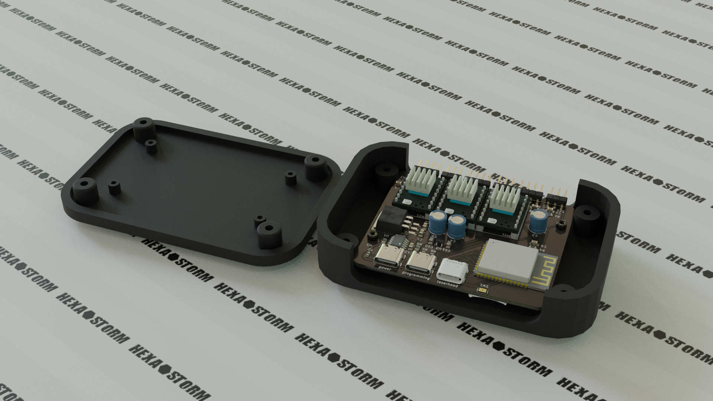

# Hexastorm PCB
This repository provides two modules;
 * **Laser module**  
    Contains six PCBs for the laser head. A box is created by the PCBs.  
    A baseboard, a front and back plate, a side plate and a top plate.  
    The laser module is standalone and can be controlled via SPI.  
 * **Main board**  
    Main board can be used to control the laser head via USB C.
    It is powered by a ESP32 and has three stepper motors. 
    In addition there is a programming port and also power connector (USB C).
    Board is depicted below. ESP32 S3 provides 32 mb onboard storage. A micro SD card reader is present for
    extra memory. The main board is placed in this box 100x67x22mm, AK-NW-84.  
      
    
    
A blog with progress updates is available on [Hackaday](https://hackaday.io/project/21933-open-hardware-fast-high-resolution-laser). 

# Status
Several systems were designed. A successful exposure is shown in this [video](https://youtu.be/dR09Tev0cPk).  
The current system is going through a complete iteration. Older versions of the laser head can be found in
the old branch of this repo.    
A presentation on the current target is found [here](https://youtu.be/b7ArZDhsyfI).  
Goals are;
  - improve documentation
  - make the laser module standalone  

