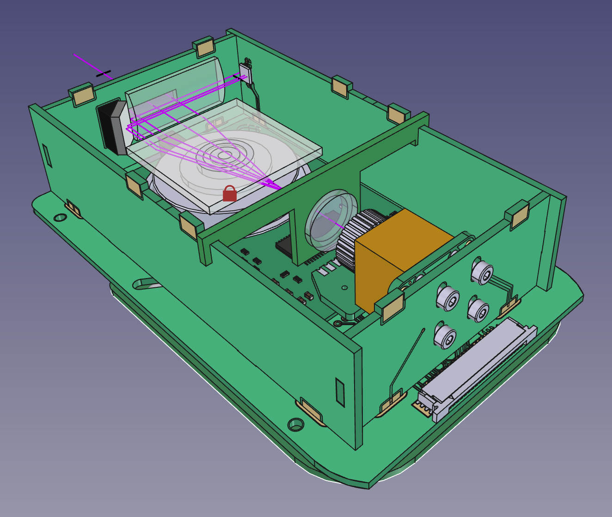
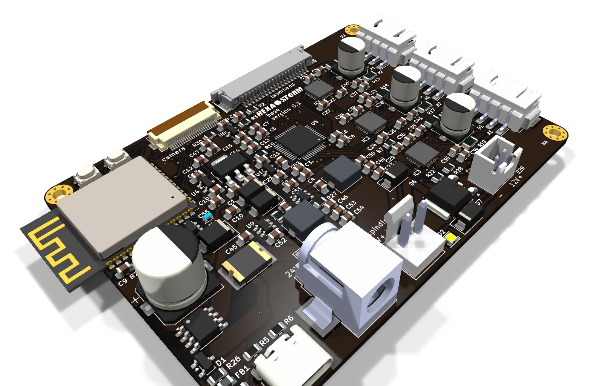

# Hexastorm PCB

KiCad design files for **Hexastorm**, an open-hardware laser direct imager (LDI). An ESP32-S3 handles communication and motion control, while an iCE40 UP5K FPGA generates synchronized laser pulses for the rotating polygon prism.

The design files are organized into two parts:

## 1. Laser Module

PCBs forming the scanhead assembly (see [hexastorm_design](https://github.com/hstarmans/hexastorm_design) for complete CAD):
* **Prism Drive:** PCBs to spin the optical prism using either an external BLDC motor or an experimental PCB stator motor.
* **Laser Control:** Diode driver and photodiode sync circuit.
* **Maxwell Dock:** Receiver PCB with kinematic ball mounts and magnet sockets.

## 2. Base Board

Single-board controller for 3-axis motion and laser timing. Intended for desktop CNC frames (such as the CNC 3018 Pro), though mounting brackets and custom wiring are required (not a direct drop-in replacement):

* **MCU:** ESP32-S3 (N32R8V) with 8MB Octal PSRAM for line buffers.
* **FPGA:** Lattice iCE40 UP5K for laser pulse timing synced to the prism photodiode index.
* **Camera:** 24-pin FPC connector for an OV2640 camera module.
* **Motion:** Sockets for 3x stepper drivers (TMC2209) for X, Y, and Z axes.
* **Laser:** Header for one laser scanhead.
* **Power:** 24V input with onboard 12V buck regulator for the laser module and cooling fan.
* **USB:** USB-C for data and flashing.

---

# Resources & Links
* **Blog & Build Logs:** [Hackaday.io project](https://hackaday.io/project/21933-open-hardware-fast-high-resolution-laser)
* **BOM & Costing:** Generated with [KiCost](https://github.com/hildogjr/KiCost) (see [developer.md](developer.md))
* **CAD Files:** [hexastorm_design](https://github.com/hstarmans/hexastorm_design)
* **Optical Simulation:** [opticaldesign](https://github.com/hstarmans/opticaldesign)

# Status
Several hardware revisions have been built and tested. A working exposure run is shown in this [video](https://youtu.be/dR09Tev0cPk). 
The current single-board revision is being tested.
