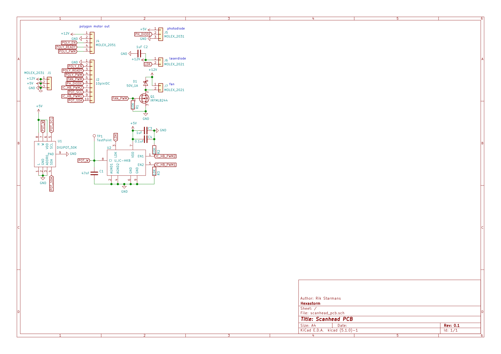

Hexastorm - Scanhead pcb
========================================

https://www.hexastorm.com

PCB for a laser head. The pcb is connected to a cape on the beaglebone and the photodiode board.
There are components on both sides of the board.

# Status
The board has been fully tested. All functions work.

# Pinout mirror motor
The polygon motor is a modified Ricoh AF-1027/270 with a NBC3111 chip. The motor operates at
21000 RPM. The reflective polygon of this motor has been replaced with a
transparent prism. If you place the polygon in front of you and the pins point
toward you; the most right pin is pin one and the most left pin is pin 5. The
pinout is as follows; pin 1 is 24V, pin 2 is GND, pin 3 is GND, pin 4 is not
connected and pin 5 is PWM. The polygon motor can be connected with two
wires; GND and PWM. If it’s connected with two wires the GND should be
connected to the 24V supply voltage

# Schema

# Front Image

# Back Image

