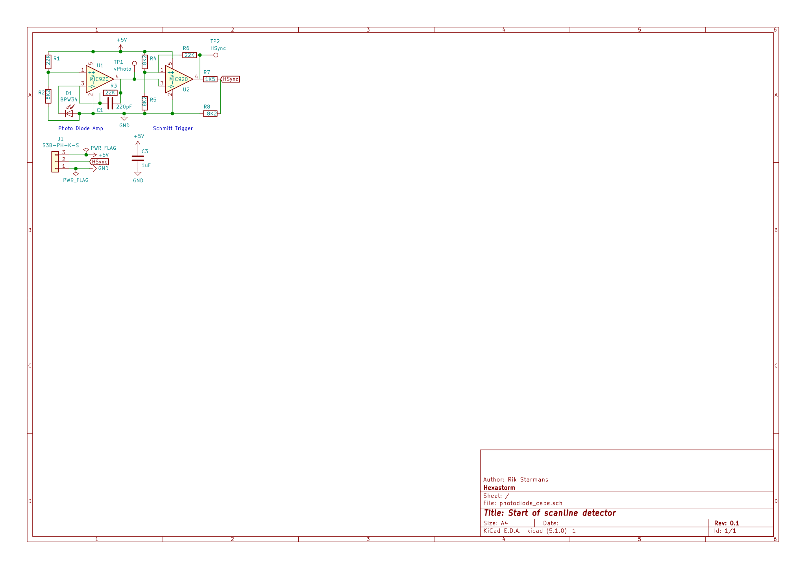

Hexastorm - Start of scanline detector
========================================

https://www.hexastorm.com

PCB for detecting the start of scanline of laserscanner by amplifying signal with opamp and then reading it out via Schmitt trigger.
Circuit was copied from earlier work of [Henner Zeller](https://github.com/hzeller/ldgraphy/tree/master/pcb/cape).
The two holes in the board are intented for surrounding the photodiode with a cap. This was needed in an earlier version where a voltage divider was used to read out the photodiode. The photodiode should work fine without cap.

# Status
The board has bene fully tested. [Hamamatsu](https://www.hamamatsu.com) sells dedicated IC's like the S9684 series which have these circuits integrated.

# Schema

# Image

